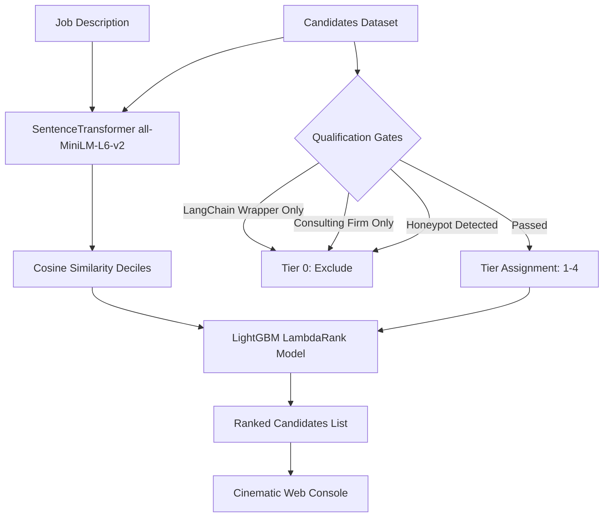

# 🧬 CareerDNA // AI Recruiter Brain
> **Predictive Candidate Ranking Engine for Founding Teams**

[](https://nextjs.org/)
[](https://github.com/microsoft/LightGBM)
[](https://www.python.org/)
[](#-web-console-interface)

Are you ready to redefine the future of talent acquisition? Traditional keyword filters miss the hidden gems—the candidates whose true potential, intent, and subtle behavioral signals are lost in the noise. 

**CareerDNA** is an **AI Recruiter Brain** featuring an end-to-end candidate qualification gating, relevance-tiering, and Learning-to-Rank (LTR) scoring runtime that ranks the best candidates for founding team roles, presented in a state-of-the-art cinematic web interface.

---

## 🧠 Brain Architecture & Model Flow

CareerDNA processes Job Descriptions (JDs) and ranks candidates through a multi-stage filtering and ranking pipeline:



### 1. Hard Disqualification Gates (Tier 0)
Candidates are filtered out if they trigger any of the following gates:
*   **LangChain Wrapper Trap**: Candidates with recent LLM experience but no older core ML, NLP, or systems experience.
*   **Consulting Firm Trap**: Candidates whose entire career consists of services/outsourcing firms (e.g., TCS, Infosys, Wipro, Accenture).
*   **Honeypot Detection**:
    *   *Claim Verification*: Claiming "expert" level on a skill with $\le 6$ months experience.
    *   *Tenure Discrepancy*: Discrepancy between stated years of experience and actual computed career history tenure.
*   **Closed-Source Only**: Experience $\ge 5$ years but with no GitHub activity, certifications, or verified skills.

### 2. Relevance Tiers (1 to 4)
*   **Tier 4 (Ideal Match)**: Production information retrieval/embeddings evidence + 6-8 YOE + product company ratio $\ge 0.7$.
*   **Tier 3 (Strong Fit)**: Production retrieval/embeddings evidence + 4-10 YOE.
*   **Tier 2 (Mid Technical)**: Technical title + basic ML/retrieval signals.
*   **Tier 1 (Technical Generalist)**: Default technical generalist candidate.

### 3. LightGBM Learning-to-Rank (LTR)
A pretrained LightGBM ranker (`ranker_model_v2.txt`) trained with a `lambdarank` objective optimizes search relevance (NDCG@10/50). Key features in the gain importance matrix include:
1.  `must_have_retrieval_evidence` (Dominates selection)
2.  `feat_semantic_similarity_binned` (Corrected decile bins)
3.  `profile_years_of_experience`
4.  `verified_ml_relevant_skill_count`

---

## 💻 Web Console Interface

The CareerDNA Web Console is built in **Next.js** using a **deep cinematic dark theme** with custom vanilla CSS layout components.


### Key Features
*   ✨ **Visual Reranking Engine**: Real-time slider inputs adjust the weight of **Semantic Similarity**, **Production Retrieval**, **Seniority**, **Reliability**, and **Notice Period** client-side. The dashboard dynamically updates matching scores and reshuffles profiles on the fly!
*   📄 **JD Analyzer Widget**: A side panel displaying the active job description and its parsed AI rules, complete with toggleable editor modes.
*   🚦 **Triage Controls**: Instant filtering by relevance tiers, geographic hubs (Pune, Noida, Bangalore, Delhi), search query keywords, and a toggle to inspect **Disqualified** candidates.
*   💾 **Detailed Profile overlays**: Full-screen console cards featuring:
    *   **AI Justification Log**: Direct natural language explanations from the LTR model.
    *   **Pedigree Indicators**: University tier badges and connection counts.
    *   **Open Source Grid**: Simulated GitHub activity heatmaps.
    *   **Behavioral Signals**: Expected salary ranges, willingness to relocate, and notice periods.
    *   **Interactive Career Timelines**: Staggered vertically-expanding career histories.

---

## 📁 Repository Layout

```bash
├── notebooks/                   # Jupyter research notebooks
│   ├── semantic-embeddings.ipynb
│   ├── jd-rule-extraction.ipynb
│   ├── ltr-model-training.ipynb
│   └── ...
├── output/                      # Model outputs & scored datasets
│   ├── ltr_model_training/      # LightGBM booster ranker models
│   └── result_template/         # submission.csv & candidates database
├── src/
│   └── app/                     # Next.js App Router
│       ├── page.js              # Main dashboard component
│       ├── layout.js            # Page layout wrapper
│       ├── globals.css          # Design system stylesheet
│       └── candidates.json      # Combined pool database of 599 candidates
├── package.json                 # Next.js dependencies configuration
└── next.config.mjs              # Next.js configurations
```

---

## 🚀 Running the Web Console Locally

Follow these steps to run the Next.js console on your system:

### 1. Prerequisites
Ensure you have Node.js (v18+) and npm installed.

### 2. Install Dependencies
In the root directory, run:
```bash
npm install
```

### 3. Run Development Server
Start the development environment:
```bash
npm run dev
```
Open [http://localhost:3000](http://localhost:3000) in your browser to view the cinematic dashboard.

### 4. Build for Production
Create an optimized production build:
```bash
npm run build
npm run start
```

---

## 🛠️ Hugging Face Space & GitHub Integration
Pushed to production at [CareerDNA on GitHub](https://github.com/Kritika11052005/CareerDNA.git). Ready to be deployed as a static or Node.js space on Hugging Face using your HF authentication token!

Developed with ❤️ for **Redrob AI**.
